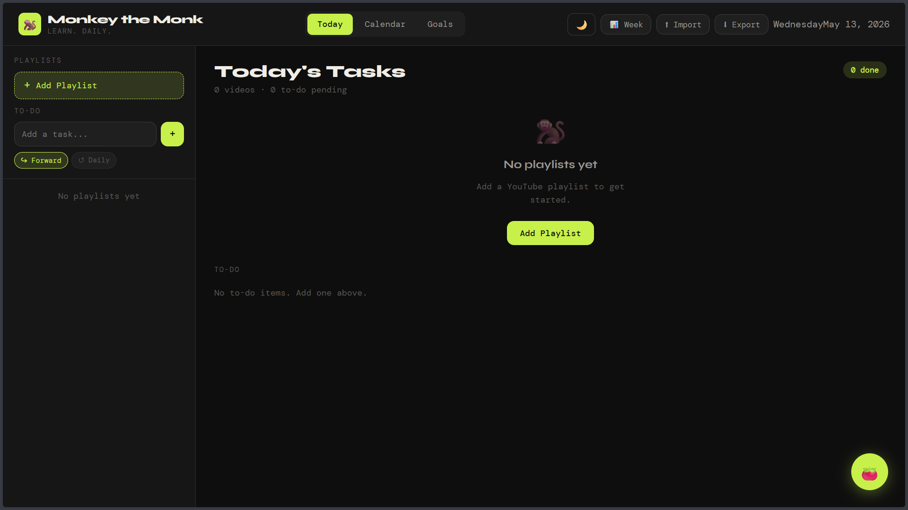

# 🐒 Monkey the Monk


## 🐒 Why the Name?

Students are generally monkeys — distracted, jumping between videos, and learning without structure.

> From distracted watching to structured learning.

Monkey the Monk is built around the idea of transforming chaotic consumption into focused, consistent progress — one video, one task, and one session at a time.


Built for learners who save hundreds of tutorials but struggle to stay consistent.

---

🌐 Live Demo: https://monkeythemonk.vercel.app/

---

## 📸 Preview



---

## ✨ Features

- YouTube playlist scheduling
- Daily learning task generation
- Custom videos-per-day targets
- Start scheduling from any video in a playlist
- Built-in Pomodoro focus mode
- Separate to-do task system
- Weekly progress review
- Calendar-based planning
- Missed task auto-rescheduling
- Dark / Light theme
- Mobile-friendly Android UI
- Export / Import support
- Fully local-first experience

---

## 🛠 Tech Stack

**Frontend**
- HTML
- CSS
- Vanilla JavaScript

**Backend**
- Vercel Serverless Functions

**APIs & Storage**
- YouTube Data API v3
- localStorage

---
## ⚡ Architecture

The frontend communicates with a Vercel serverless API route which securely proxies requests to the YouTube Data API, preventing exposure of API keys on the client side.

---

## 📂 Project Structure

```text
MonkeyTheMonk/
│
├── api/
│   └── youtube.js
│
├── LICENSE
├── README.md
├── index.html
└── vercel.json
```

---

## 🚀 Setup

### 1. Clone the repository

```bash
git clone <your-repository-url>
```

### 2. Configure environment variables

Add the following variable in Vercel:

```env
YOUTUBE_API_KEY=your_api_key

```

### 3. Deploy

Deploy the project using Vercel.

---

## 🧠 Philosophy

Most learners consume content endlessly without structure.

Monkey the Monk focuses on:
- consistency,
- focused learning,
- and sustainable daily progress.

> One playlist. One task. One focused session at a time.

---

## 🔒 Privacy

- No authentication
- No external database
- All data stored locally using `localStorage`
- API key protected through serverless backend functions
